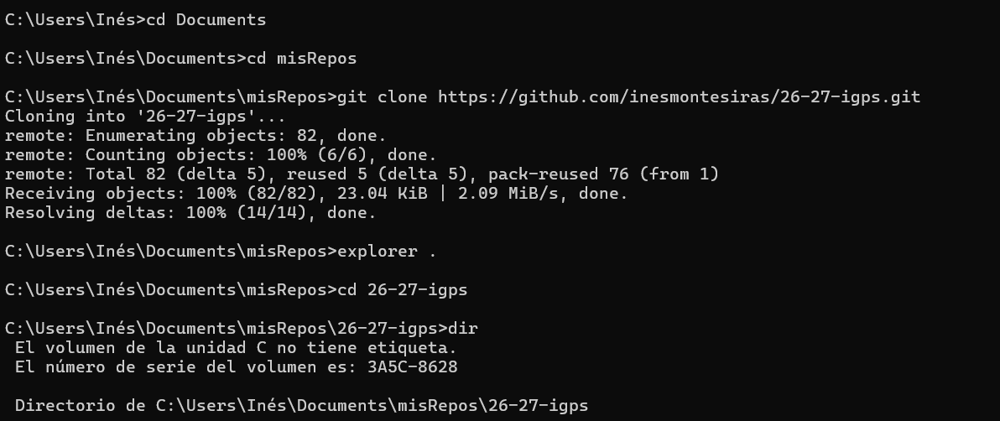
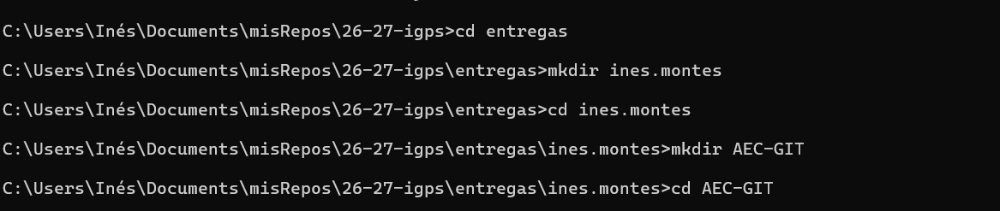
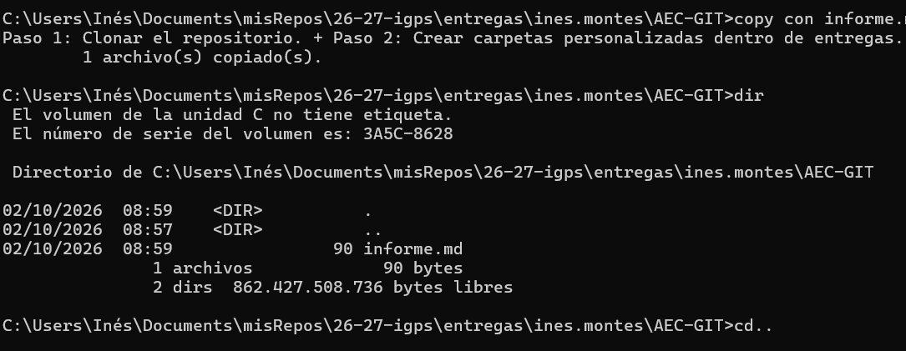
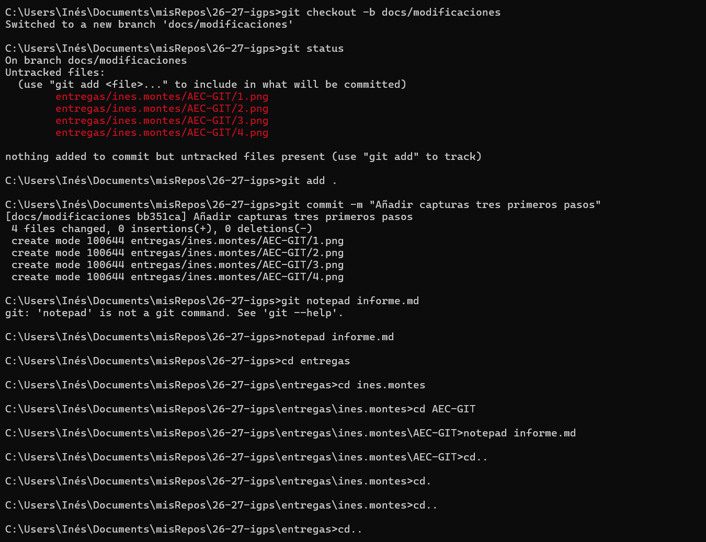
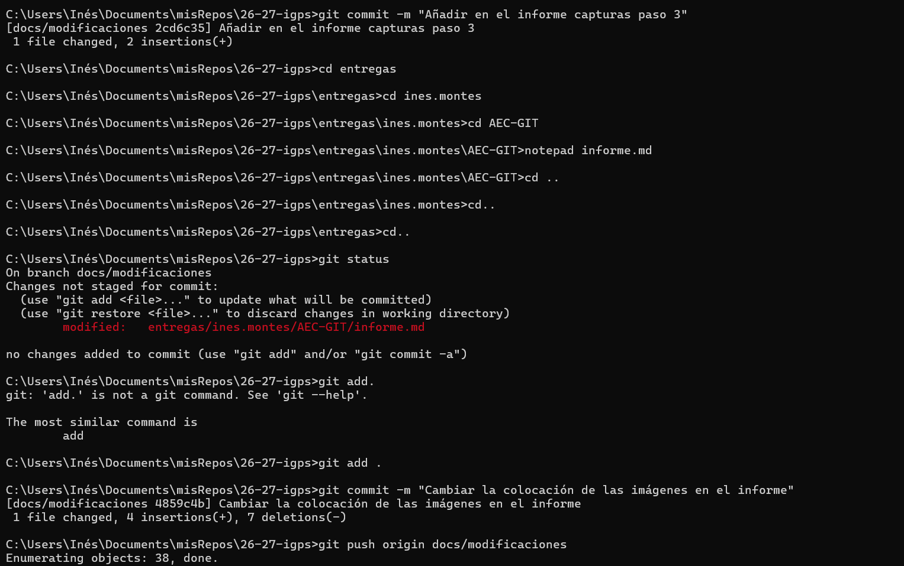

Paso 1: Clonar el repositorio. 

Paso 2: Crear carpetas personalizadas dentro de entregas.

 

Paso 3: Creación del primer archivo y primer push.

Paso 4: Cambio de rama y modificación del informe con texto y capturas de pantalla.
 

Modificación estética del informe y añadir capturas de la parte 4
 
 
 
