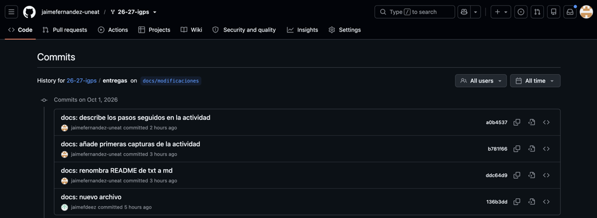
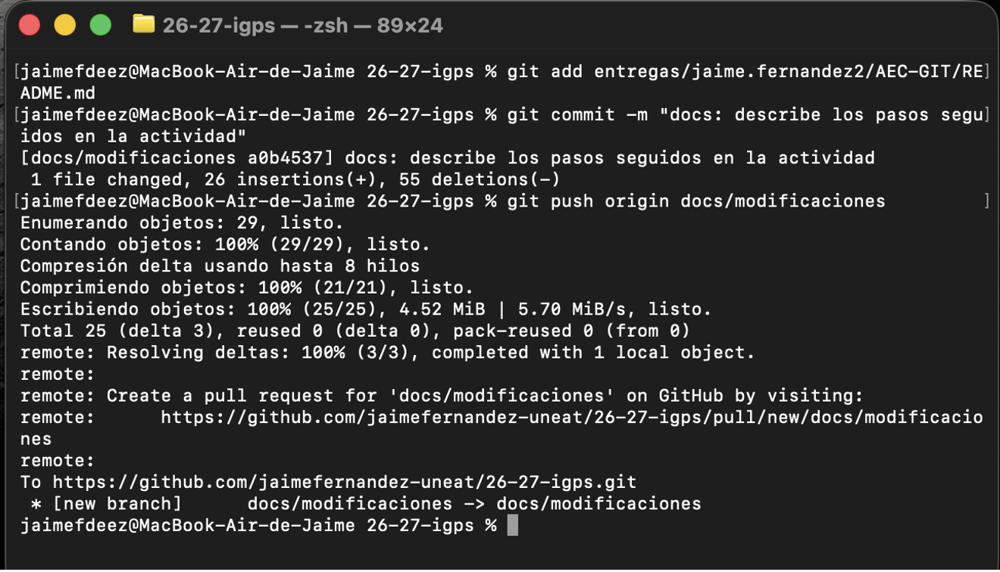
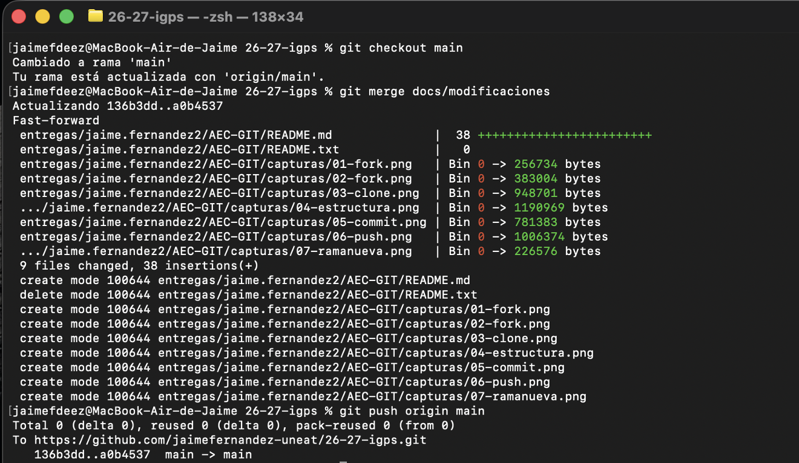

# Entrega AEC-GIT - Jaime Fernández

## 1. Fork del repositorio
Hice fork del repositorio para tener una copia propia en mi cuenta.


## 2. Clonado en local
Una vez hecho el fork, cloné el repositorio en mi ordenador:

```bash
git clone https://github.com/jaimefernandez-uneat/26-27-igps.git
```


## 3. Estructura de carpetas
Dentro de la carpeta del proyecto creé la estructura `entregas/jaime.fernandez2/AEC-GIT`.


## 4. Primer commit
Dentro de `AEC-GIT` creé un archivo de texto vacío, `README.txt`. Después lo añadí al área de staging, creé un commit y subí los cambios a mi fork:

```bash
git add .
git commit -m "docs: nuevo archivo"
git push origin main
```


## 5. Rama docs/modificaciones
Creé una nueva rama y me cambié a ella, para trabajar en el informe sin tocar `main`:

```bash
git checkout -b docs/modificaciones
```


En esta rama guardé los cambios por partes, en varios commits:



Al terminar, subí la rama a mi fork:

```bash
git push origin docs/modificaciones
```



## 6. Merge con la rama principal
Volví a `main` y combiné los cambios de la rama de trabajo:

```bash
git checkout main
git merge docs/modificaciones
git push origin main
```

No hubo conflictos porque `main` no había cambiado desde que creé la rama. Git hizo un *fast-forward*: simplemente movió `main` hasta el último commit de `docs/modificaciones`.



