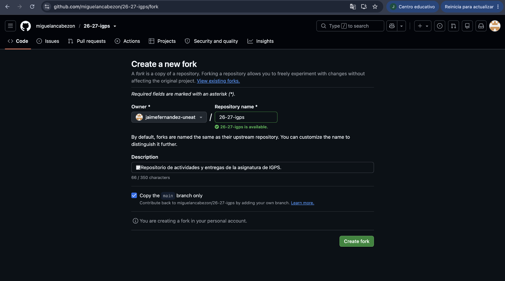
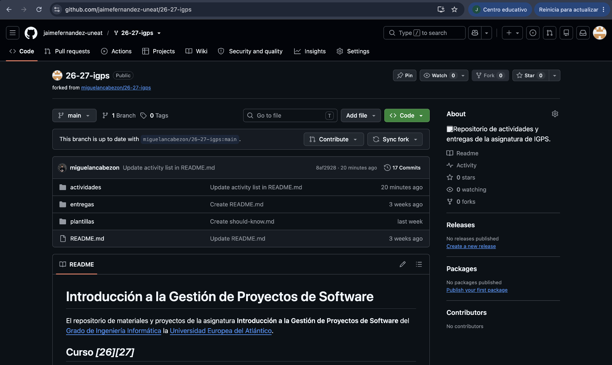
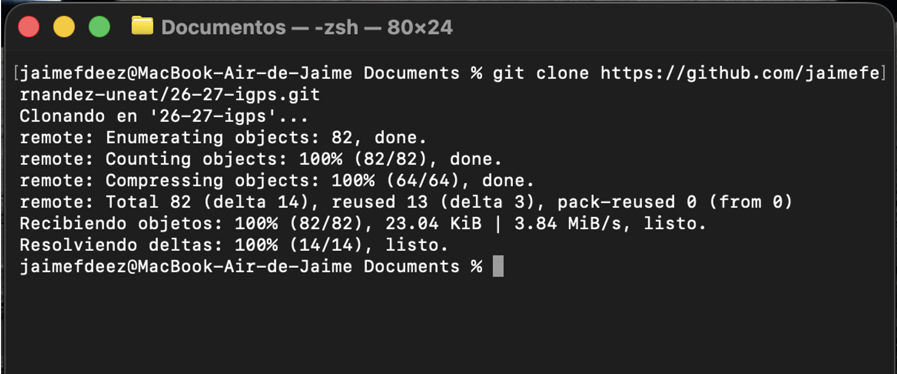
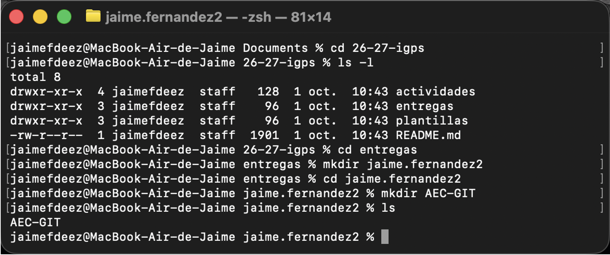
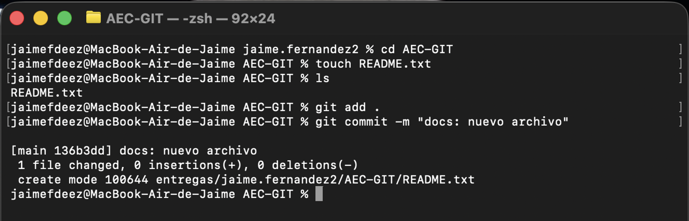
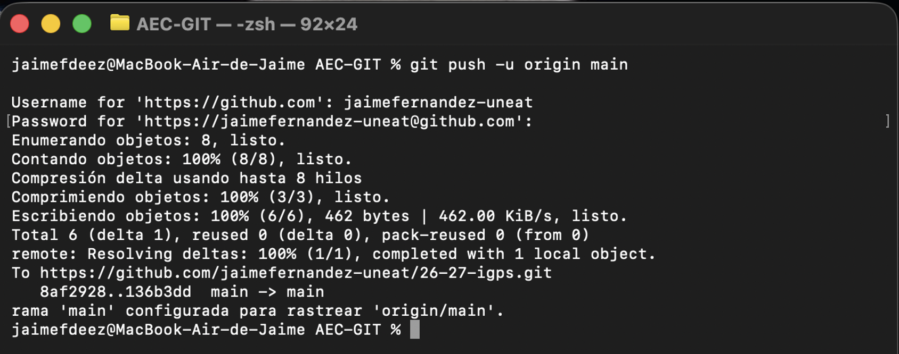
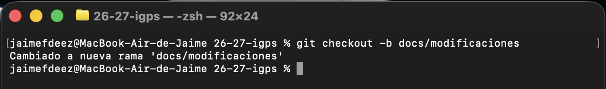

# Entrega AEC-GIT - Jaime Fernández

## 1. Fork del repositorio
Hice fork del repositorio para tener una copia propia en mi cuenta.




## 2. Clonado en local
Una vez hecho el fork, cloné el repositorio en local en mi ordenador usando
​ ```git clone https://github.com/jaimefernandez-uneat/26-27-igps.git
​```



## 3. Estructura de carpetas
Una vez clonado, dentro de la carpeta del proyecto creé la estructura de carpetas `entregas/jaime.apellido/AEC-GIT`.



## 4. Primer commit
Dentro de la carpeta AEC-GIT, creé un archivo de texto vacío "README.txt", añadí el nuevo archivo al área de staging, creé un commit y subí estos cambios a mi repositorio remoto.   
​```git add .
git commit -m "docs: nuevo archivo"
git push origin main
​```




## 5. Rama docs/modificaciones
Creé y cambié a una nueva rama ​```bash
git checkout -b docs/modificaciones
​```




