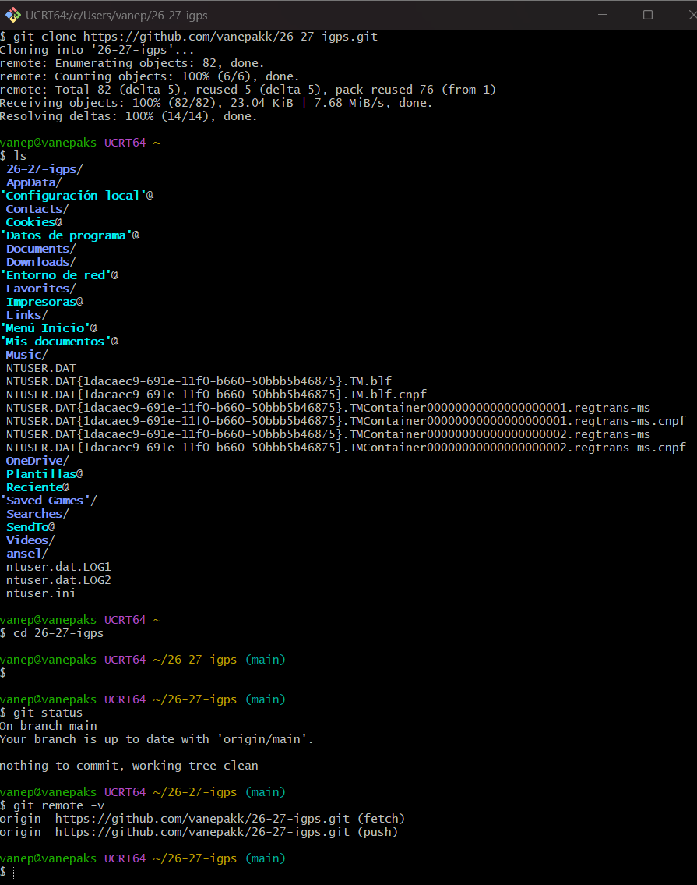

# AEC-GIT

## Paso 1: Fork

Se realizó un fork del repositorio original proporcionado por el profesor.

## Paso 2: Clonación

Se clonó el repositorio utilizando Git mediante el comando:

`git clone`

## Paso 3: Estructura de carpetas

Se creó la estructura indicada por el profesor:

`entregas/tu.nombre/AEC-GIT`

## Paso 4: Primer commit

Se creó el archivo README.md y se añadió al área de staging mediante:

`git add .`

Posteriormente se realizó el commit con el mensaje solicitado:

`docs: nuevo archivo`

## Paso 5: Push

Los cambios se subieron al repositorio remoto mediante:

`git push origin main`

## Paso 6: Creación de la rama

Se creó una nueva rama llamada:

`docs/modificaciones`

utilizando:

`git checkout -b docs/modificaciones`

