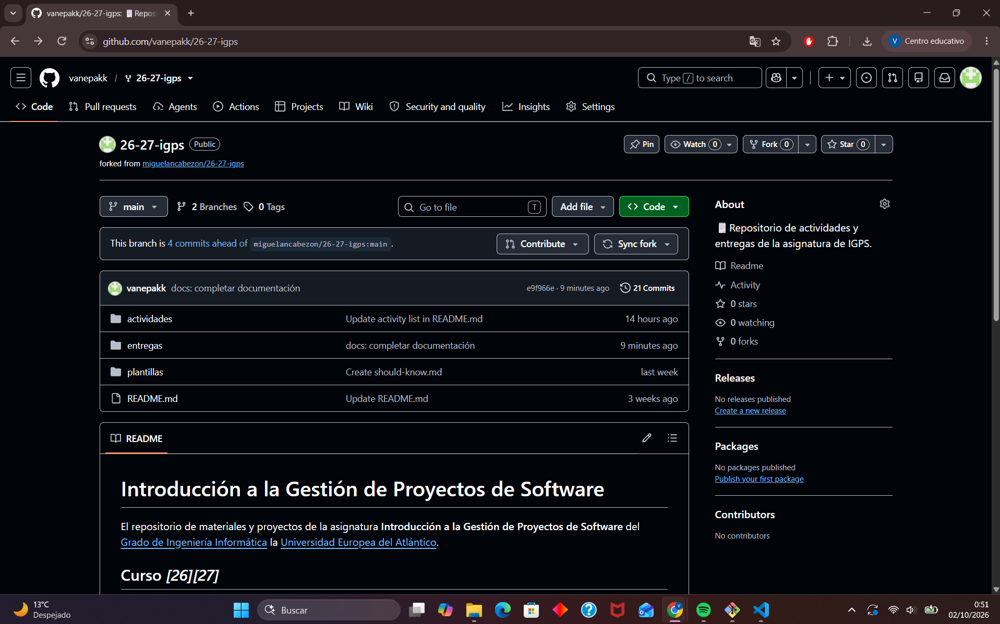
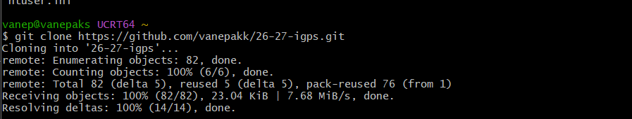
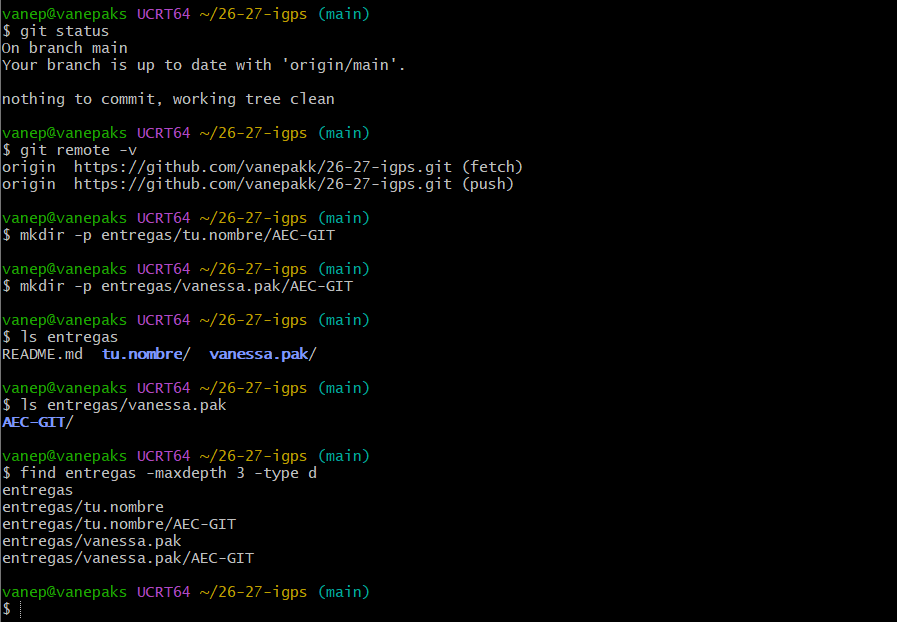
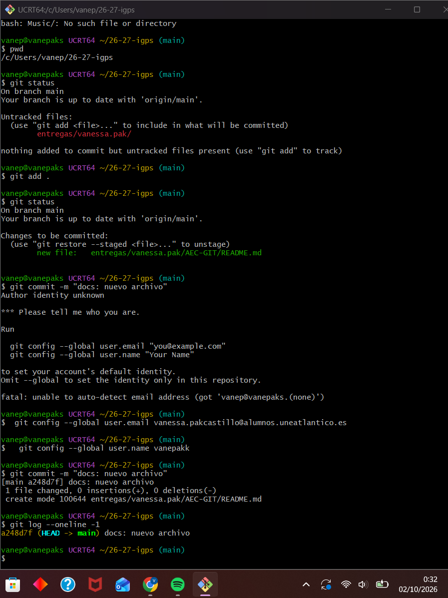
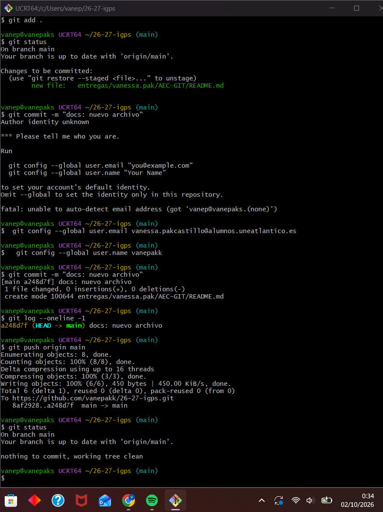
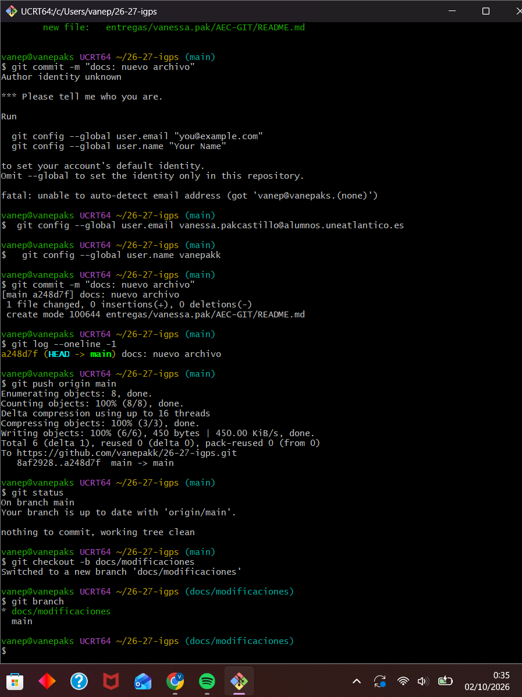
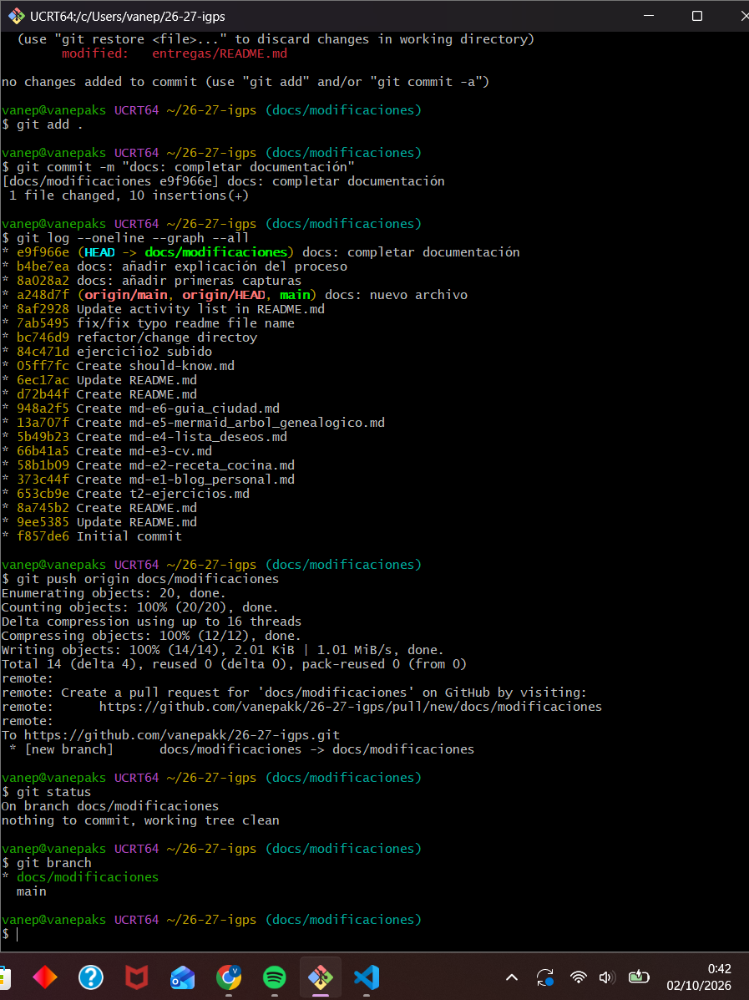
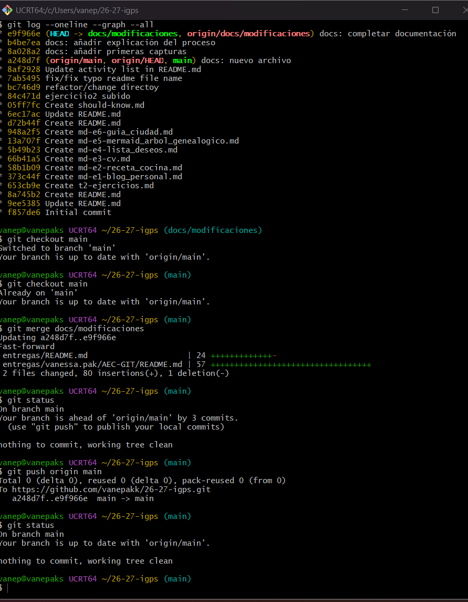
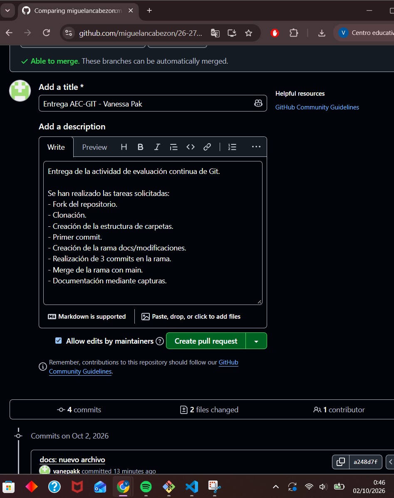

# AEC-GIT

## Paso 1 - Fork del repositorio

Primero se realizó un fork del repositorio original proporcionado por el
profesor. De esta forma se creó una copia del repositorio en mi cuenta de
GitHub.

![Fork del repositorio] 

![Fork realizado]

## Paso 2 - Clonación del repositorio

Después del fork se clonó el repositorio en el ordenador utilizando Git.

El comando utilizado fue:

`git clone URL_DEL_REPOSITORIO`

![Clonación del repositorio] 

## Paso 3 - Creación de la estructura de carpetas

Dentro del proyecto se creó la estructura de carpetas solicitada:

`entregas/nombre.apellido/AEC-GIT`

![Estructura de carpetas] 

## Paso 4 - Primer commit

Dentro de la carpeta `AEC-GIT` se creó el archivo `README.md`.

Después se añadió el archivo al área de staging mediante:

`git add .`

A continuación se realizó el primer commit con el mensaje exacto solicitado:

`docs: nuevo archivo`

![Primer commit] 

## Paso 5 - Push a GitHub

Una vez realizado el primer commit, se subieron los cambios al repositorio
remoto utilizando:

`git push origin main`

## Paso 6 - Creación de la rama

Desde la rama principal se creó una nueva rama llamada:

`docs/modificaciones`

utilizando el comando:

`git checkout -b docs/modificaciones`

![Creación de la rama] 

## Paso 7 - Trabajo en la nueva rama

Una vez creada la rama `docs/modificaciones`, se continuó trabajando en ella
y se añadieron las capturas y la documentación de la actividad.

Se realizaron varios commits descriptivos para guardar los cambios de forma
organizada.

![Push de la rama] 
 

